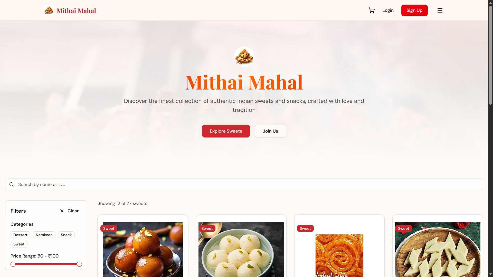
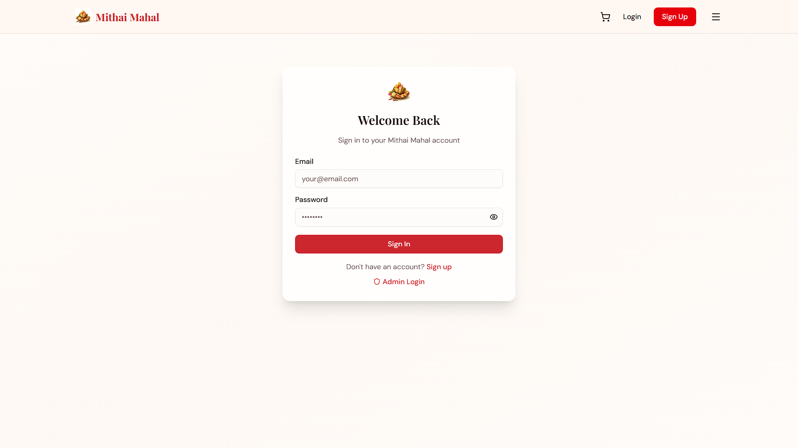
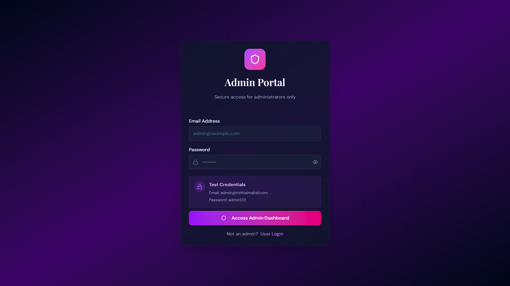
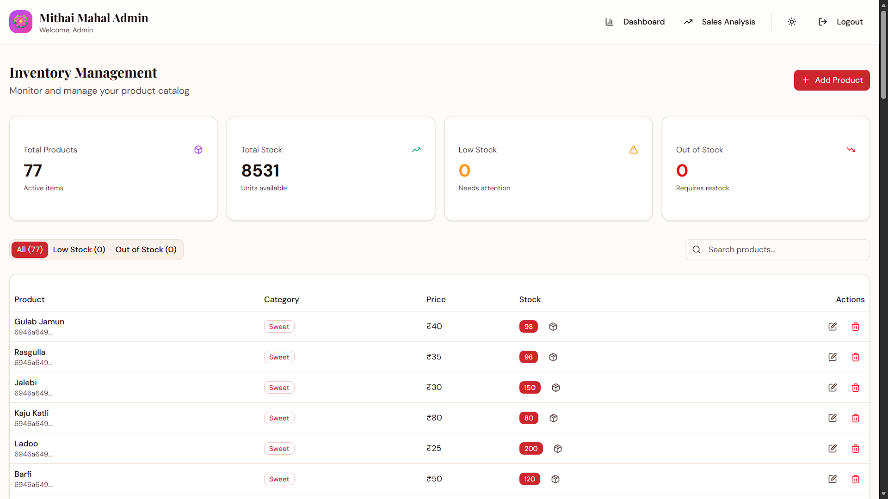

# Sweet Shop Management System
A modern full-stack Sweet Shop Management System designed for online sweet ordering with secure authentication and admin management.  
This project is built as a college final-year project and is suitable for portfolio and interview presentation.

---

## Project Overview

The Sweet Shop Management System enables customers to browse sweets, register or log in, and access the application securely.  
Admins can log in through a dedicated admin panel and manage shop operations using a clean dashboard.

This project demonstrates:
- Real-world **full-stack development**
- **Authentication & role-based access**
- Modern UI/UX design
- Production-level deployment

---

## Tech Stack

### Frontend
- Next.js
- React
- TypeScript
- Tailwind CSS

### Backend / Services
- API-based architecture
- Authentication & authorization
- Environment-based configuration

### Deployment
- Vercel

---

## Live Demo

🔗 https://sweet-shop-green-two.vercel.app

---

## Features

### User Features
- User Sign Up & Login
- Secure authentication
- Responsive design
- Clean UI for browsing

### Admin Features
- Admin login
- Admin dashboard
- Role-based access control
- Secure admin authentication

---

## Project Screenshots

### Home Page

---

### User Sign In

---

### Admin Login

---

### Admin Dashboard

│## Project Structure

sweet-shop/
├── public/
├── src/
├── screenshots/
│   ├── Home.png
│   ├── SignIn.png
│   ├── Adminlogin.png
│   └── Admindashboard.png
├── README.md
├── DEPLOYMENT.md
├── package.json
└── next.config.ts

---

## Future Enhancements

- Online payment integration
- Order tracking system
- Product management (CRUD operations)
- Analytics dashboard
- Email notifications
